<h1 align="center">基于SpringBoot+Vue的民谣网站【带论文】</h1>

- <b>完整代码获取地址：从戎源码网 ([https://armycodes.com/](https://armycodes.com/))</b>
- <b>技术探讨、资料分享，请加QQ群：692619798</b>
- <b>作者微信：19941326836  QQ：3645296857</b>
- <b>承接计算机毕业设计、Java毕业设计、Python毕业设计、深度学习、机器学习</b>
- <b>选题+开题报告+任务书+程序定制+安装调试+论文+答辩ppt 一条龙服务</b>
- <b>所有选题地址 ([https://github.com/Descartes007/allProject](https://github.com/Descartes007/allProject)) </b>

## 一、项目介绍

基于SpringBoot+Vue的民谣网站，分为 管理员（后台） 与 普通用户/游客两类角色。系统已实现的主要功能如下：
### 管理员（后台）
- 基本：登录、登出、修改密码、获取/修改个人信息（session/token 鉴权）
- 用户管理：分页查询、列表、查看详情、新增、修改、删除、重置密码
- 歌曲管理：后台分页/详情/新增/修改/删除
- 论坛管理：帖子分页/详情/新增/修改/删除
- 资讯/公告管理：CRUD、后台分页/详情
- 留言与歌曲留言管理：CRUD、后台分页/详情
- 收藏管理：收藏记录的查看与管理
- 账户：注册、登录、退出、密码重置
- 浏览：公开列表与详情（歌曲 、论坛 、资讯 、留言 ）
- 交互：前端新增（发帖、歌曲添加 、留言 等）、评论/留言、对内容点赞/踩
- 收藏：收藏/取消收藏歌曲
- 文件：头像/文件上传
- 前端体验：富文本编辑（发布/编辑帖子、资讯等）

## 二、项目技术

- 编程语言：Java
- 后端框架：Spring Boot 2.2.2, Spring MVC,MyBatis-Plus / MyBatis,MySQL,Fastjson，Hutool, Apache Commons,
- 前端框架：Vue 2 + vue-router，Element UI，axios，vue-quill-editor（富文本），vue-cli

## 三、运行环境

- JDK版本：1.8及以上都可以
- 操作系统：Windows7/10、MacOS
- 开发工具：IDEA、Ecplise、MyEclipse都可以

## 四、数据库配置文件

- npm版本：6.14.13及以上都可以
- Redis版本：3.2.100及以上都可以
- 文件名：application.yml
- 编码类型：utf8

## 论文截图

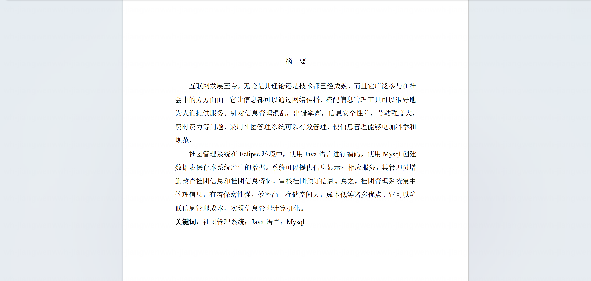

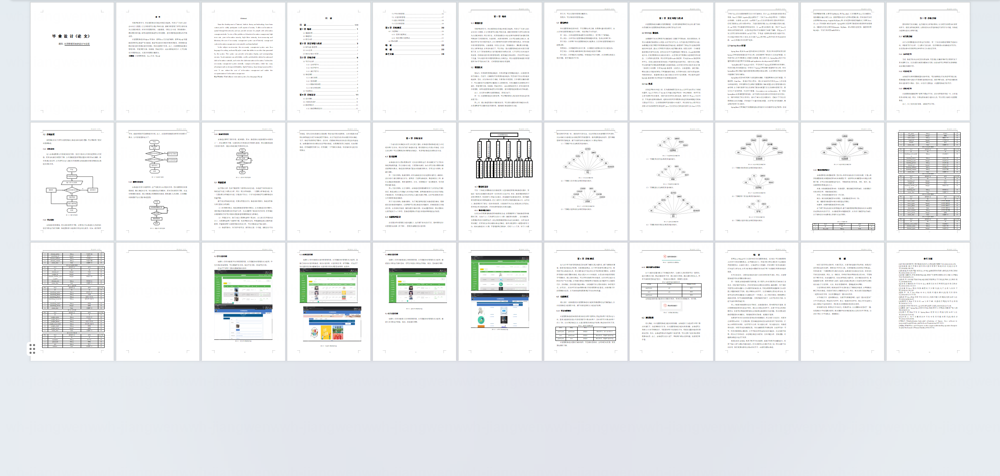

## 系统截图

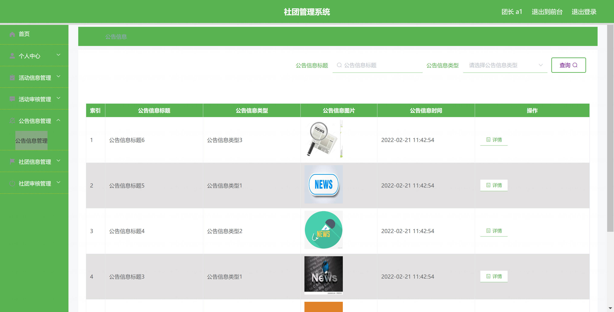

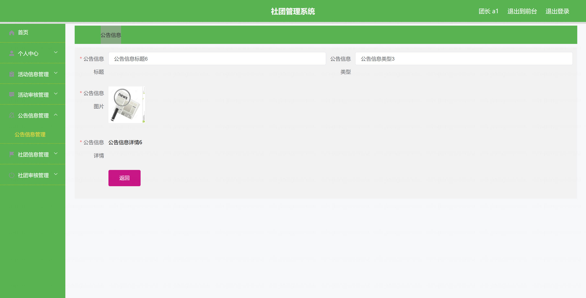

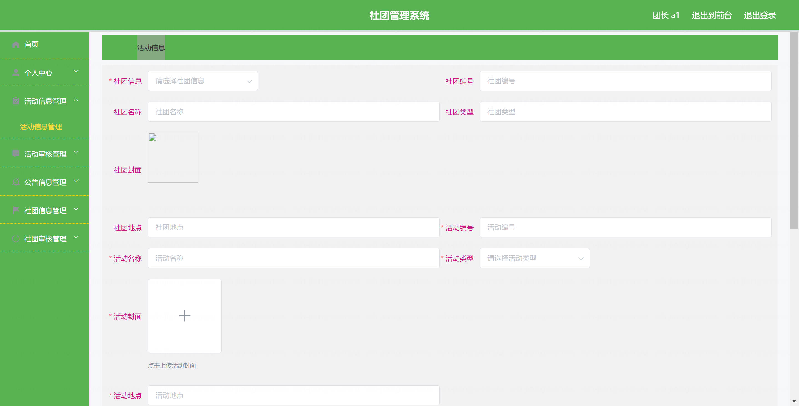

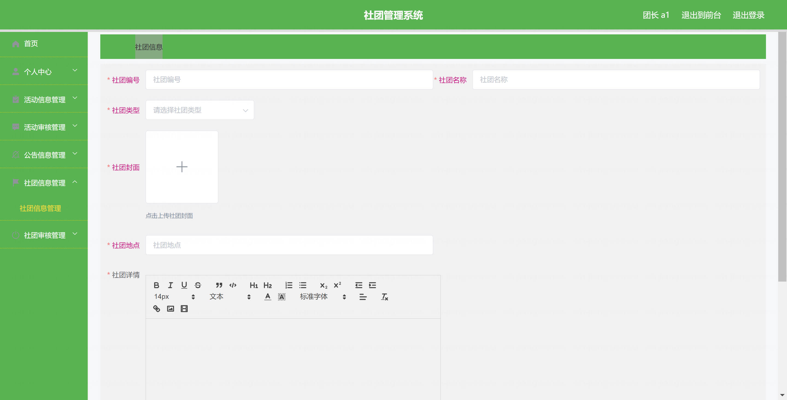

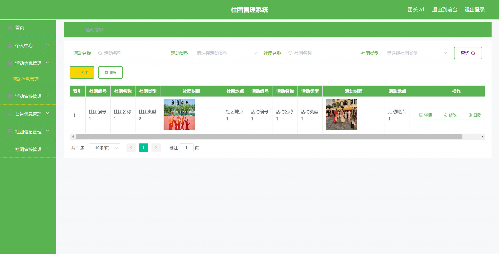

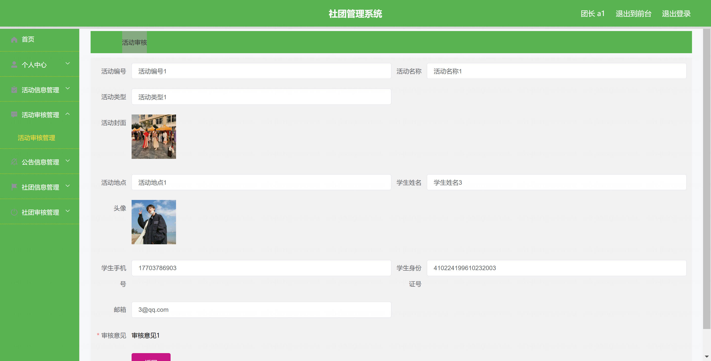

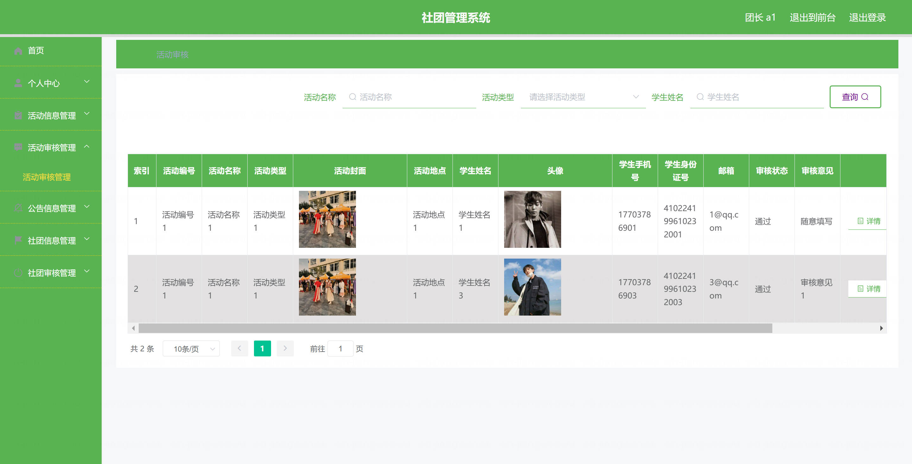

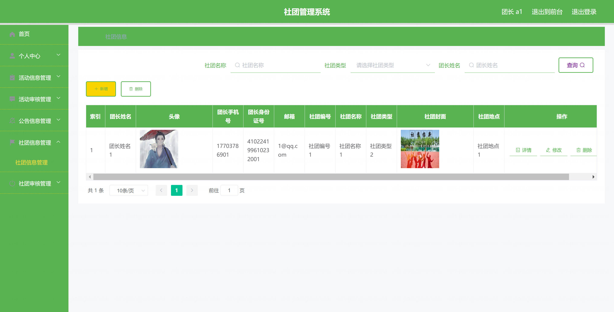

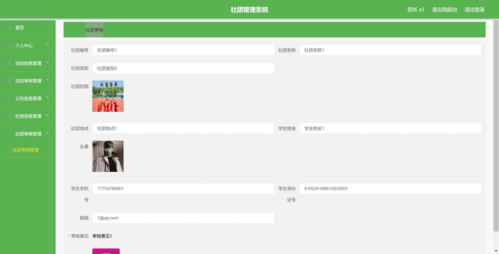
